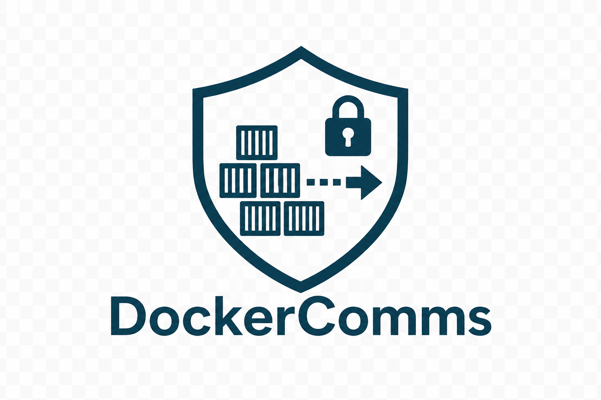
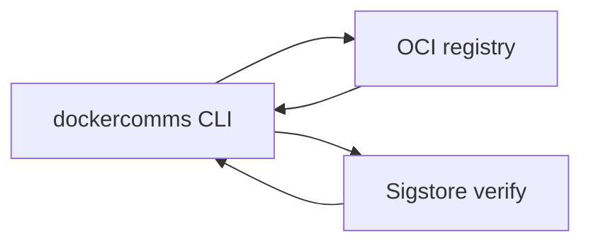

<p align="center">
  
</p>

# DockerComms

[](https://github.com/codethor0/dockercomms/actions/workflows/ci.yml?query=branch%3Amain)
[](https://github.com/codethor0/dockercomms/actions/workflows/codeql.yml?query=branch%3Amain)

OCI-native secure file transport CLI. Push and pull files as OCI artifacts with signing, verification, and verify-before-materialize semantics.

## What it does

DockerComms moves files through registries you already use (GHCR, Docker Hub, GCR, and other OCI-compatible endpoints). Payloads are chunked, compressed, and published as standard OCI artifacts with strict inbox tagging. Recipients discover messages by tag, verify signatures and digests, then materialize files only after verification succeeds.

**Problem:** ad-hoc file sharing over object storage or custom APIs often skips consistent signing, discovery, and safe write semantics.

**Approach:** reuse OCI distribution, Cosign-compatible bundles, and a small CLI with a fixed exit-code contract for automation.

## Security properties

- **Verify-before-materialize:** payload bytes are not written to the destination path until bundle verification and digest checks pass.
- **Path hardening:** filenames are reduced to a safe basename; traversal and archive-bomb limits apply.
- **Stable exit codes:** `0` success, `2` verification failed, `3` auth, `4` protocol/format, `5` not found, `1` other (see below).

## Architecture (overview)



Send, receive, and trust flows are documented with diagrams in [docs/architecture.md](docs/architecture.md).

## Quickstart

**Requirements:** Go 1.25+ (see `go.mod`), registry credentials, and Cosign v3 for signing workflows.

```bash
git clone https://github.com/codethor0/dockercomms.git
cd dockercomms
make build
./dockercomms version
./dockercomms send --help
```

**Local registry smoke test** (no GHCR):

```bash
docker run -d --name dc-reg -p 15000:5000 registry:2
REPO=localhost:15000/demo
./dockercomms send --repo "$REPO" --recipient team-a --sign=false /path/to/file
./dockercomms recv --repo "$REPO" --me team-a --out /tmp/out --verify=false --write-receipt=false
```

Full reproducible commands: [docs/repro.md](docs/repro.md).

## Commands

| Command | Purpose |
|---------|---------|
| `send` | Chunk, upload, tag inbox artifact, sign |
| `recv` | Discover inbox, verify, reassemble, write safely |
| `verify` | Check digest against bundle without writing payload |
| `ack` | Publish receipt artifact |
| `version` | Print build metadata |

## Exit codes

| Code | Meaning |
|------|---------|
| 0 | Success |
| 1 | Generic failure |
| 2 | Verification failed |
| 3 | Registry auth or permission error |
| 4 | Protocol or format error |
| 5 | Not found |

## Release scope

This repository is **source and documentation** for the DockerComms v1.0 line (currently **1.0.0-rc3** per [CHANGELOG.md](CHANGELOG.md)). It is suitable for public review, integration, and operator evaluation. **Final GA** (signed release artifacts, immutable tags, and operator attestation) is a separate maintainer step and is not implied by publishing source alone.

## Documentation

| Document | Contents |
|----------|----------|
| [SPEC.md](SPEC.md) | Protocol: tags, manifests, limits |
| [ARCH.md](ARCH.md) | Packages and data paths |
| [docs/architecture.md](docs/architecture.md) | Mermaid architecture and flow diagrams |
| [docs/repro.md](docs/repro.md) | Registry and E2E reproduction |
| [RELEASE.md](RELEASE.md) | Release notes for the current RC |
| [SECURITY.md](SECURITY.md) | Vulnerability reporting |
| [CONTRIBUTING.md](CONTRIBUTING.md) | Build, test, and PR expectations |

## License

Apache-2.0. See [LICENSE](LICENSE).
