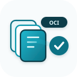
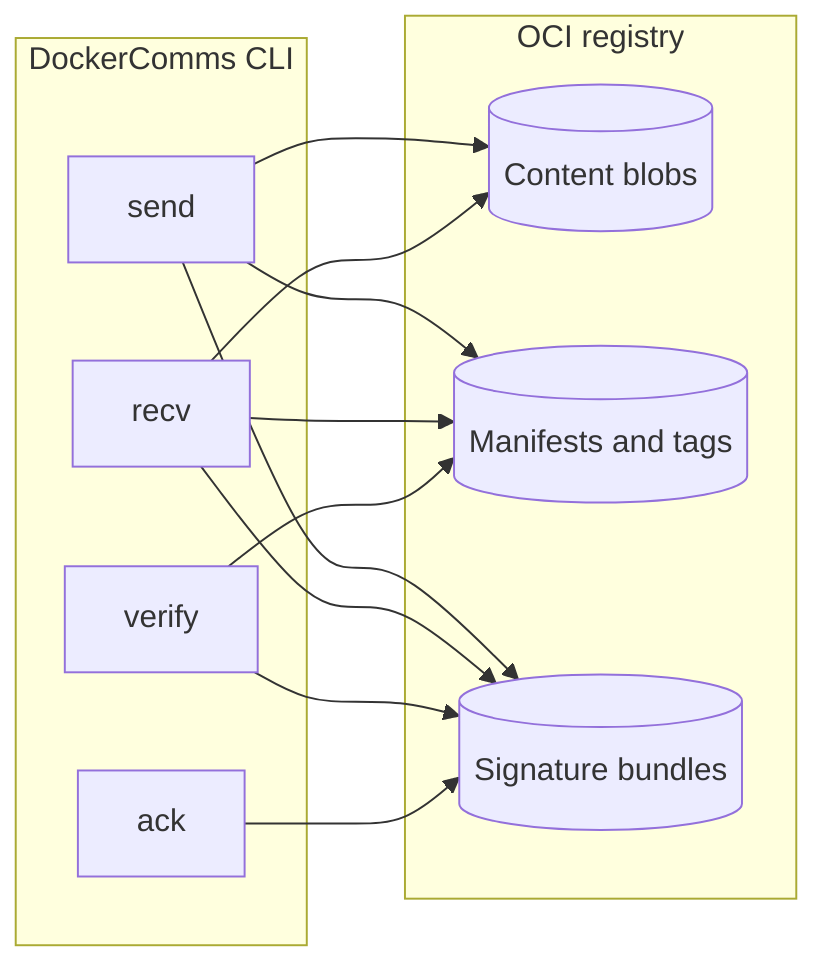
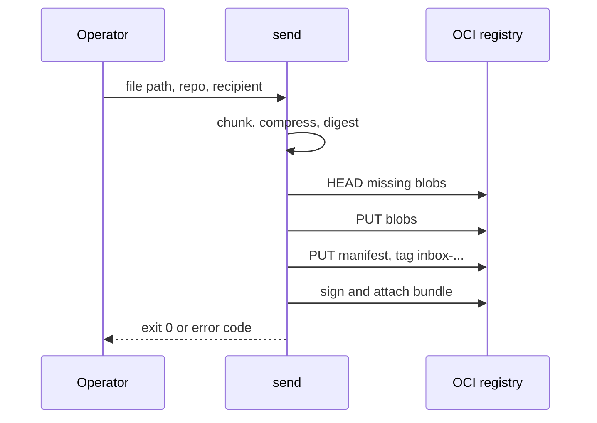
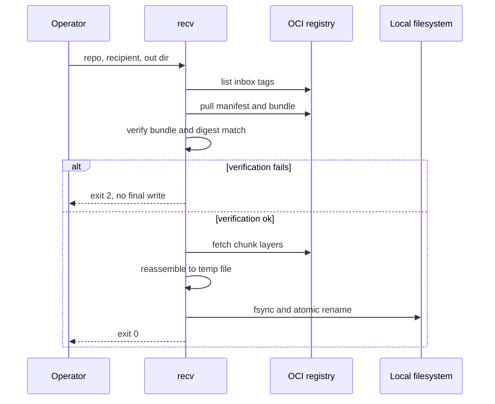
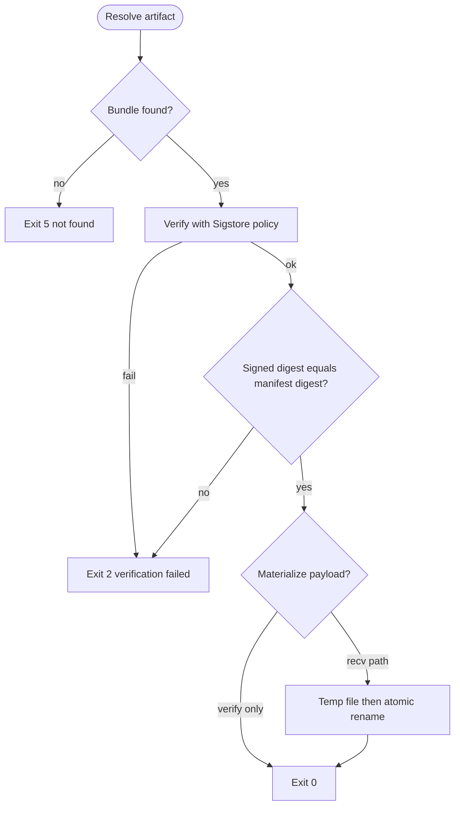
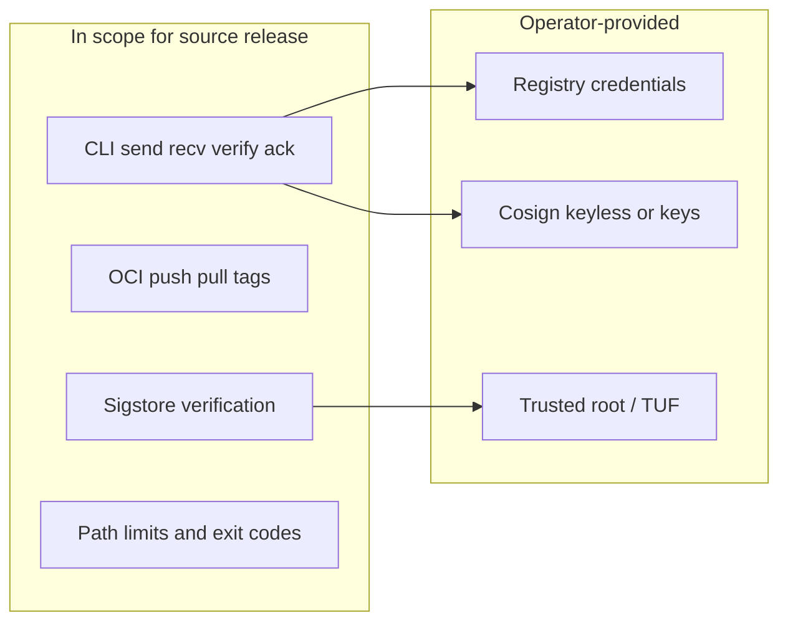

<p align="center">
  
</p>

<p align="center">
  <strong>OCI-native secure file transport</strong><br />
  Signed artifacts, registry-native discovery, verify-before-materialize.
</p>

<p align="center">
  <a href="https://github.com/codethor0/dockercomms/actions/workflows/ci.yml?query=branch%3Amain"></a>
  <a href="https://github.com/codethor0/dockercomms/actions/workflows/codeql.yml?query=branch%3Amain"></a>
  <a href="LICENSE"></a>
</p>

# DockerComms

DockerComms is a CLI for moving files through OCI registries you already operate (GHCR, Docker Hub, GCR, and compatible endpoints). Payloads are chunked, tagged, and signed; recipients verify bundles and digests before any file is written to its final path.

| | |
|---|---|
| **Use when** | Registry HTTP(S) is available and you need signed, discoverable transfers with safe write semantics |
| **Core guarantee** | Verify-before-materialize: failed verification never produces a destination file |
| **Status** | v1.0.0-rc3 source release ([CHANGELOG.md](CHANGELOG.md)); GA artifacts are a separate maintainer step |

## Security properties

- **Verify-before-materialize** — payload bytes hit the destination only after bundle verification and digest match
- **Path hardening** — safe basename only; traversal and size limits enforced
- **Automation-friendly exits** — `0` ok, `2` verify fail, `3` auth, `4` format, `5` not found, `1` other

## Architecture

DockerComms treats an OCI registry as the transport plane: content-addressed blobs store chunked payloads, manifests and inbox tags carry metadata, and Cosign-compatible bundles supply signatures. The CLI verifies bundles and digest alignment **before** writing the reassembled file to its destination.

| Layer | Responsibility |
|-------|----------------|
| `pkg/transfer` | Chunking, send/recv, verify-before-materialize |
| `pkg/oci` | Registry push/pull, tags, referrers fallback |
| `pkg/crypto` | Sigstore bundle verification |
| `pkg/cli` | Commands, exit-code mapping |

Package layout: [ARCH.md](ARCH.md). Protocol rules: [SPEC.md](SPEC.md).

### High-level architecture



### Send flow



### Receive and verify-before-materialize



### Trust and verification decision



### Release scope (v1.0 line)



## Quickstart

**Requirements:** Go 1.25+ (`go.mod`), registry credentials, Cosign v3 for signing.

```bash
git clone https://github.com/codethor0/dockercomms.git
cd dockercomms
make build
./dockercomms version
```

**Local registry (no GHCR):**

```bash
docker run -d --name dc-reg -p 15000:5000 registry:2
REPO=localhost:15000/demo
echo hello > /tmp/payload.txt
./dockercomms send --repo "$REPO" --recipient team-a --sign=false /tmp/payload.txt
./dockercomms recv --repo "$REPO" --me team-a --out /tmp/out --verify=false --write-receipt=false
```

More commands and registry paths: [docs/repro.md](docs/repro.md).

## Commands

| Command | Purpose |
|---------|---------|
| `send` | Chunk, upload, tag inbox artifact, sign |
| `recv` | Discover inbox, verify, reassemble, write safely |
| `verify` | Check digest against bundle without writing payload |
| `ack` | Publish receipt artifact |
| `version` | Build metadata |

**Exit codes:** `0` success, `2` verification failed, `3` auth, `4` format, `5` not found, `1` other.

## Documentation

| Document | Description |
|----------|-------------|
| [SPEC.md](SPEC.md) | Protocol: tags, manifests, limits |
| [ARCH.md](ARCH.md) | Packages and implementation layout |
| [docs/architecture.md](docs/architecture.md) | Pointer to README architecture section |
| [docs/repro.md](docs/repro.md) | Reproducible registry and E2E commands |
| [RELEASE.md](RELEASE.md) | RC release notes |
| [SECURITY.md](SECURITY.md) | Vulnerability reporting |
| [CONTRIBUTING.md](CONTRIBUTING.md) | Build, test, and PR checklist |

## License

Apache-2.0 — see [LICENSE](LICENSE).
