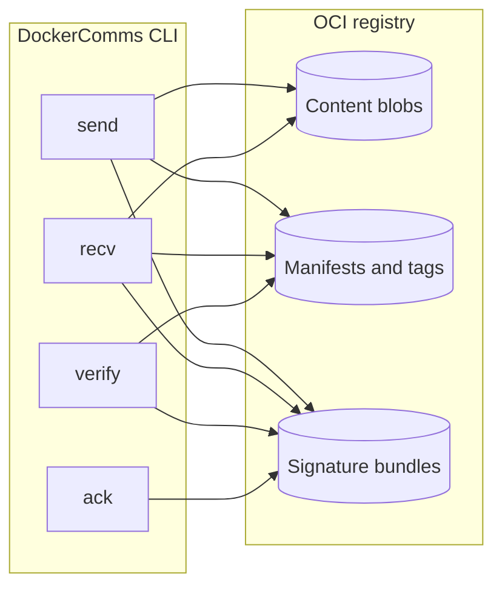
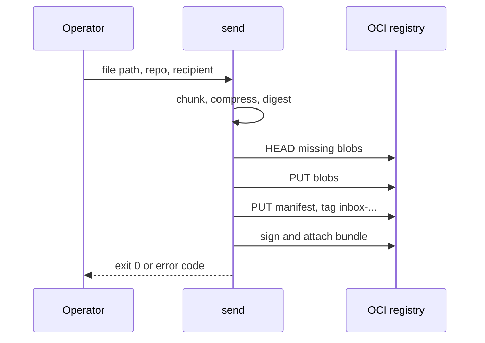
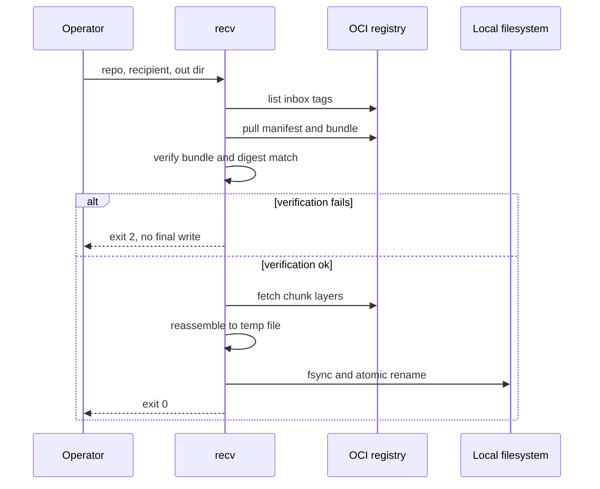
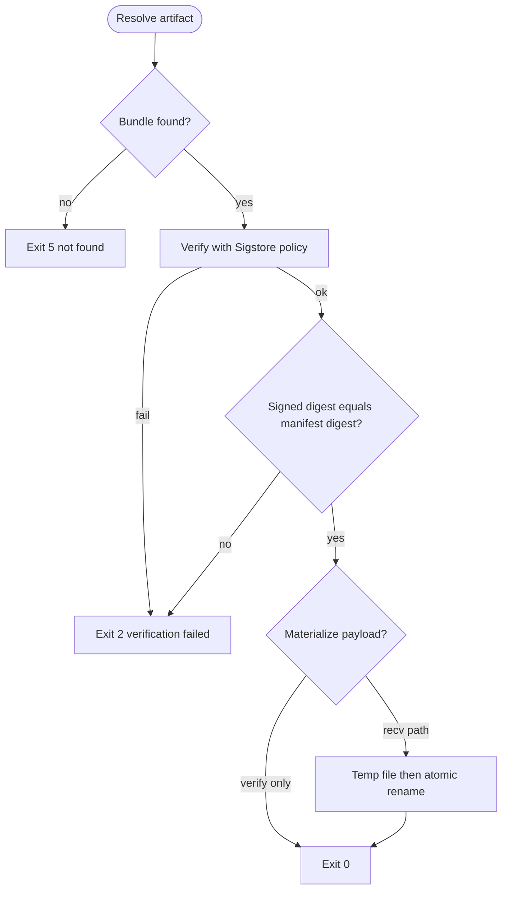
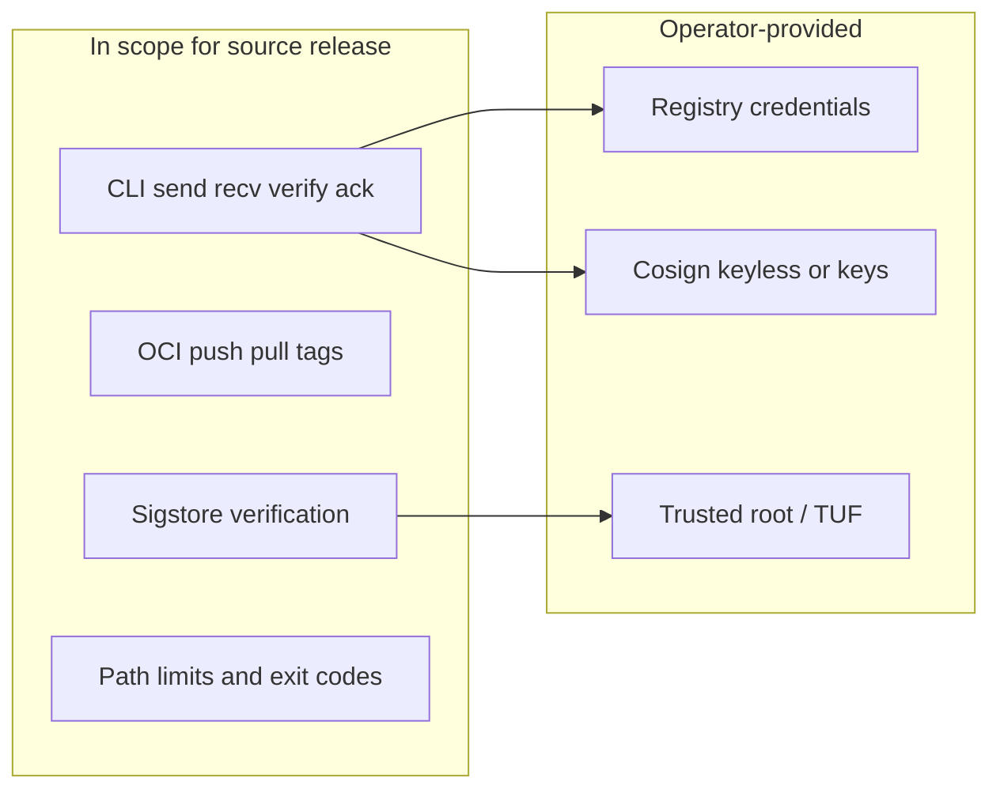

# Architecture and flows

DockerComms uses standard OCI registries as the transport. Blobs hold chunked payloads; manifests and tags carry metadata; Cosign bundles provide signatures verified before any payload is written to its final path.

See [ARCH.md](../ARCH.md) for component layout and [SPEC.md](../SPEC.md) for protocol details.

## High-level architecture

## Send flow

## Receive and verify-before-materialize

## Trust and verification decision

## Release scope (v1.0 line)

